# Campus Eats – College Canteen Ordering

## 📖 Project Overview

Campus Eats is a food ordering website for a college canteen. Students can browse the menu, add food items to their cart, and place orders online.

## 👥 Team Members

| Name | Responsibility |
|------|----------------|
| Dhatrri Nagapatla | Home Page, Menu Page |
| Laxmi Harika | Cart Page, Order Page |

## ✅ Project Milestones & Implemented Features

This project was built progressively over five structured build days (Day 7 to Day 11), successfully culminating in a fully responsive, interactive, and data-driven web application:

### Day 7 & 8: Structure & Content 
- **Architecture**: Established the project skeleton, defined team responsibilities, and wired navigation between all pages.
- **Semantic HTML**: Built out the complete structure for the **Home (`index.html`)**, **Menu (`menu.html`)**, **Cart (`cart.html`)**, and **Order (`order.html`)** pages using real, context-accurate content and proper semantic tags.

### Day 9: Design System & Styling
- **Shared CSS Tokens**: Created a unified design system (`css/style.css`) utilizing CSS variables for consistent color palettes, typography (`Archivo Black`, `Work Sans`, `IBM Plex Mono`), and layout rhythms.
- **Responsive Design**: Ensured all pages adapt flawlessly to mobile, tablet, and desktop viewports, featuring cohesive hover states and polished UI components.

### Day 10: Interactivity & JavaScript
- **Dynamic DOM Manipulation**: Implemented live updates for the cart badge and interactive filtering logic for the menu categories.
- **Form Validation**: Added robust client-side validation for the checkout form, verifying required fields and formats (email, phone numbers), complete with auto-scrolling to inline error messages.

### Day 11: Live Data & Persistence
- **State Persistence**: Integrated `localStorage` so the user's cart contents and quantities survive across page reloads.
- **API Integration**: Utilized the `fetch()` API to simulate real-time order submission, effectively handling all three application states (loading, success confirmations, and error handling).

### Day 12: Deployment & Git Collaboration
- **Live Deployment**: Successfully deployed the application to GitHub Pages, making the project publicly accessible online.
- **Git Collaboration**: Managed code collaboration via branches, pull requests, and resolved merge conflicts to merge all features for the final release.


## 📸 Screenshots & Page Walkthrough

### 🏠 Home Page
The landing page of Campus Eats introduces users to the canteen's online ordering system. It features a striking hero section and a clear, step-by-step "How it works" guide to help new students navigate the ordering process seamlessly.

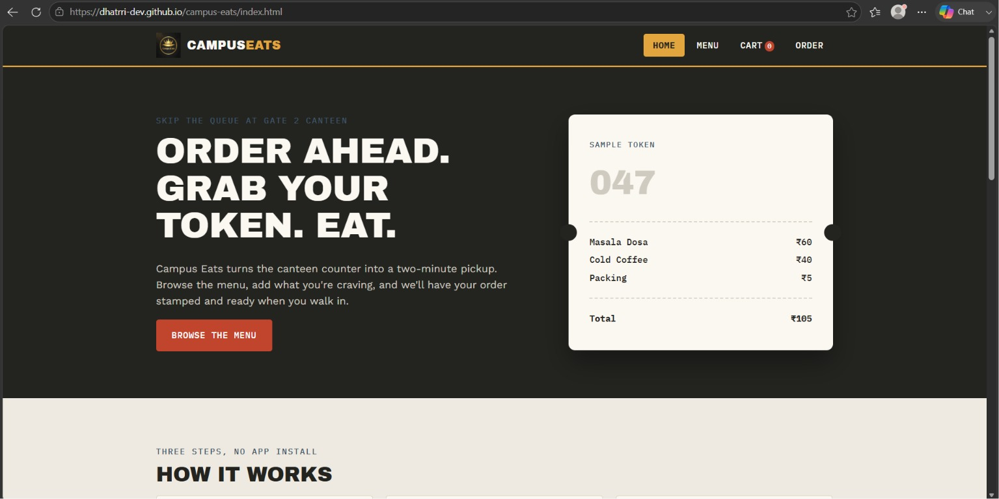

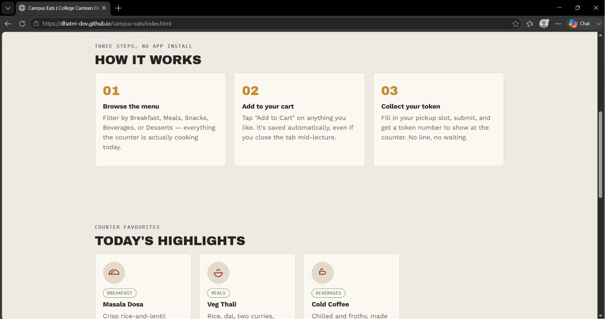

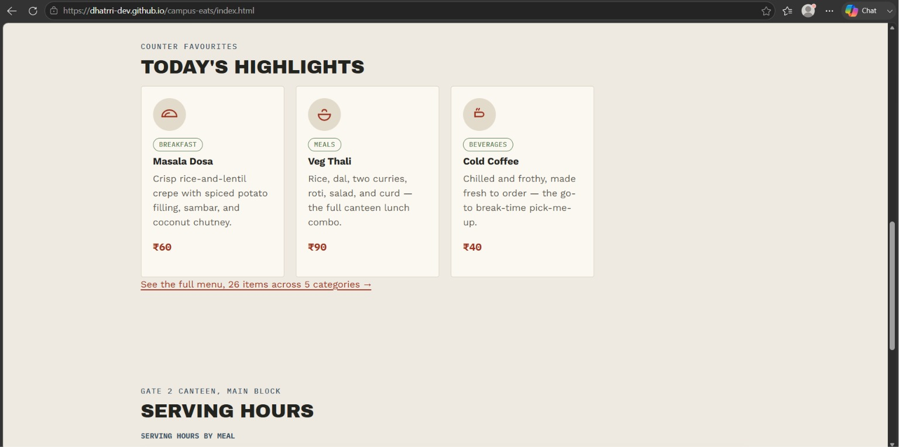

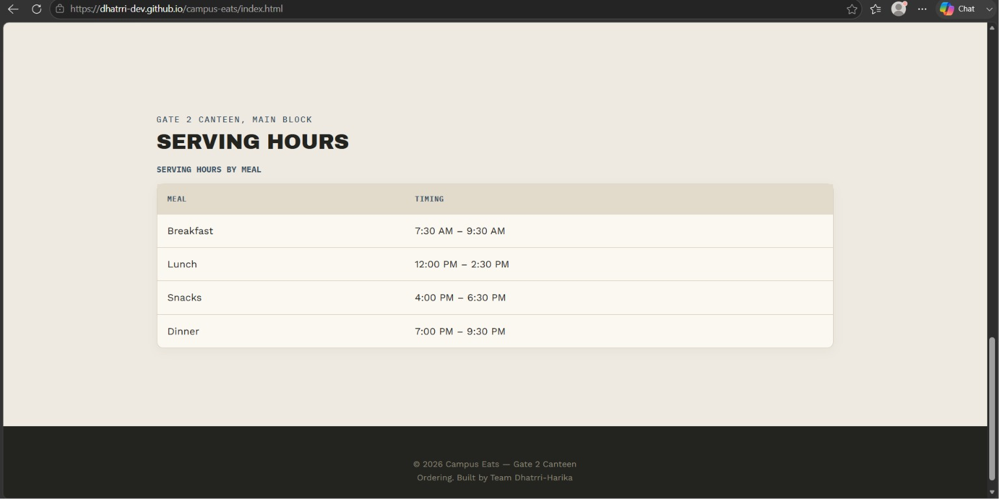

### 🍔 Menu Page
The core browsing experience. Students can view the full catalog of items, filter by categories (Breakfast, Meals, Snacks, Beverages, Desserts), and use the search bar to find specific dishes. Each item features an interactive "Add to Cart" button for quick selection.

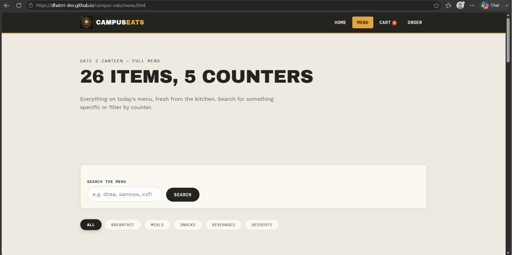

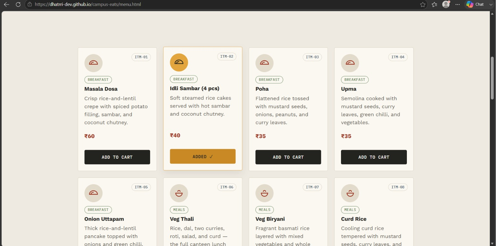

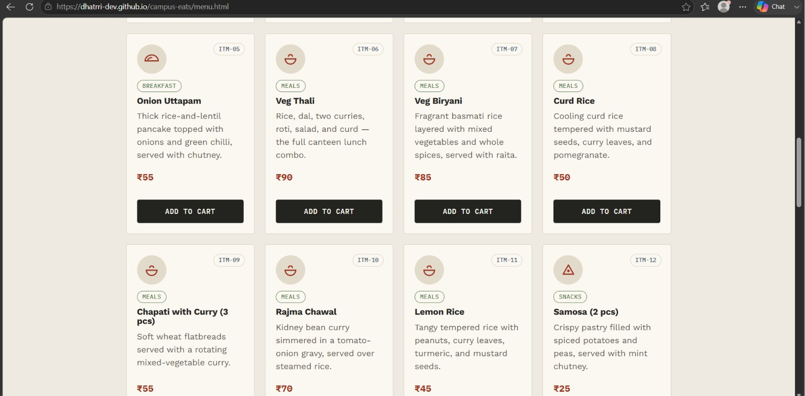

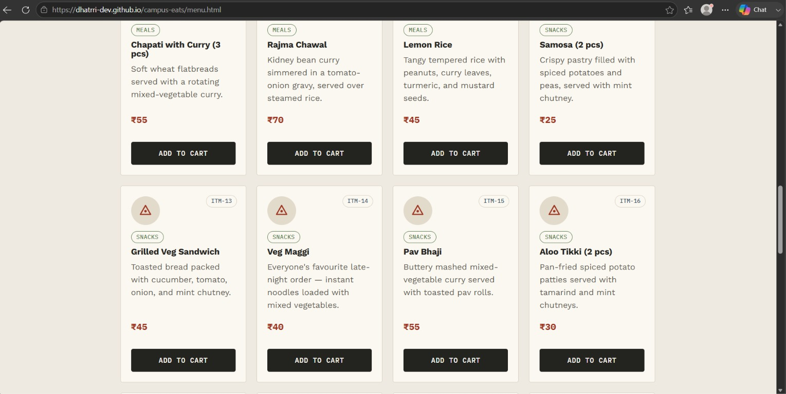

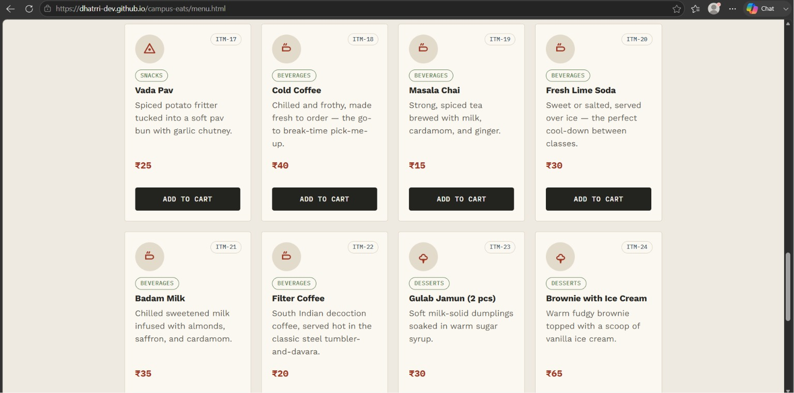

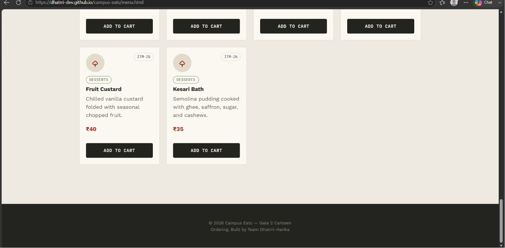

### 🛒 Cart Page
A dynamic shopping cart where users can review their selected items, adjust quantities, or remove dishes. It uses a modern two-column layout on desktop to automatically calculate subtotals, packing charges, and the grand total. The cart contents persist locally so nothing is lost if the tab is closed.

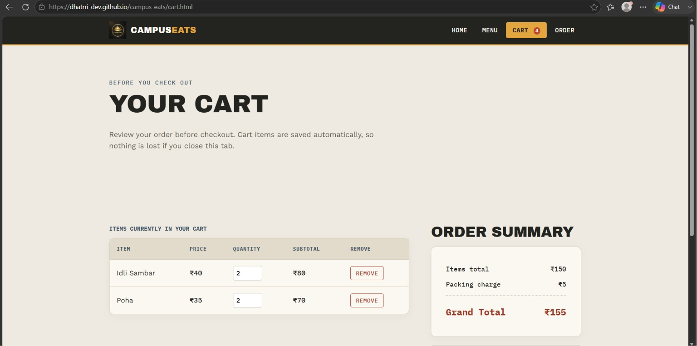

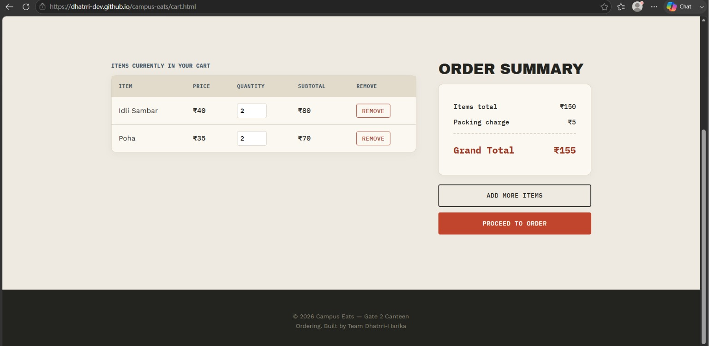

### 📝 Order Page
The final checkout step. Users provide their contact information, select their hostel block, choose a pickup time, and decide on a payment method (Cash or UPI). The form includes robust real-time validation to ensure all necessary details are provided before submission.

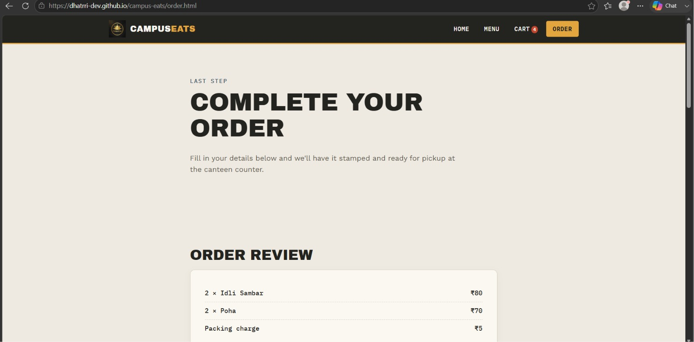

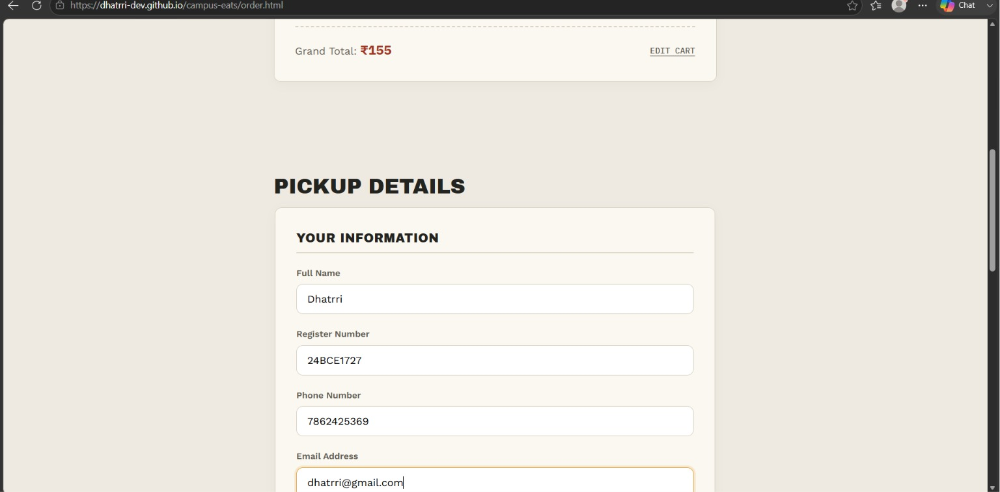

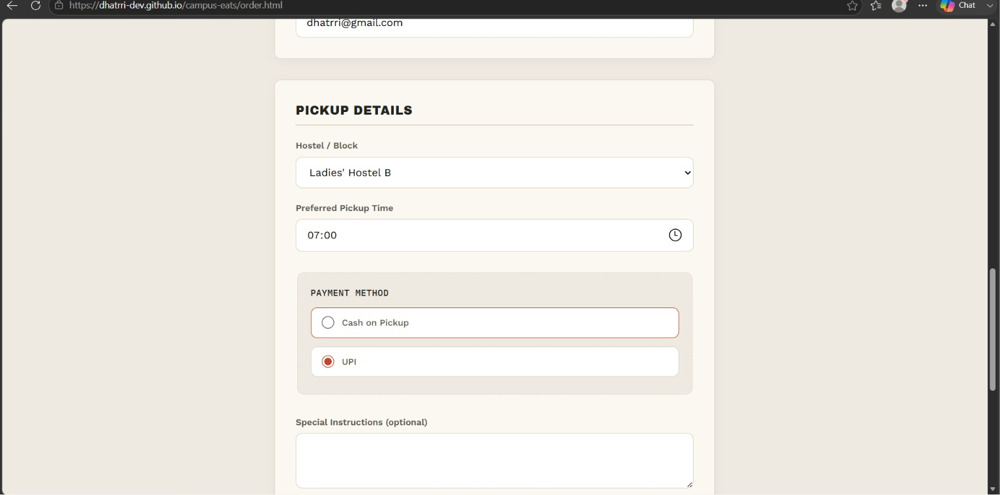

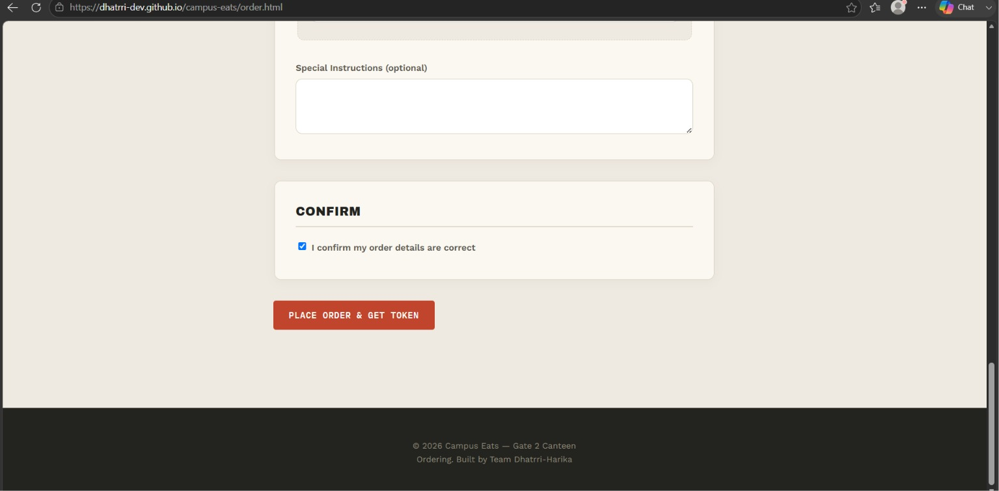

### ✅ Order Confirmed (Token Generated)
Upon successful order placement, the form disappears and the user is presented with a dynamically generated, unique digital token stub. They can present this beautiful UI token at the physical canteen counter to collect their food, perfectly bridging the digital and physical experience.

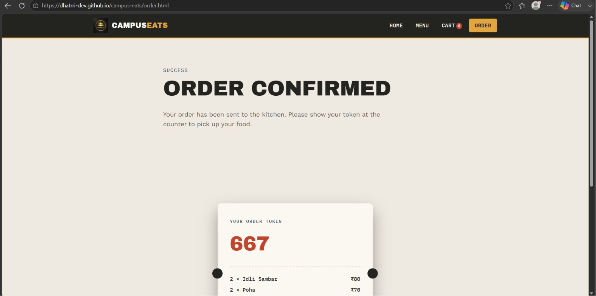

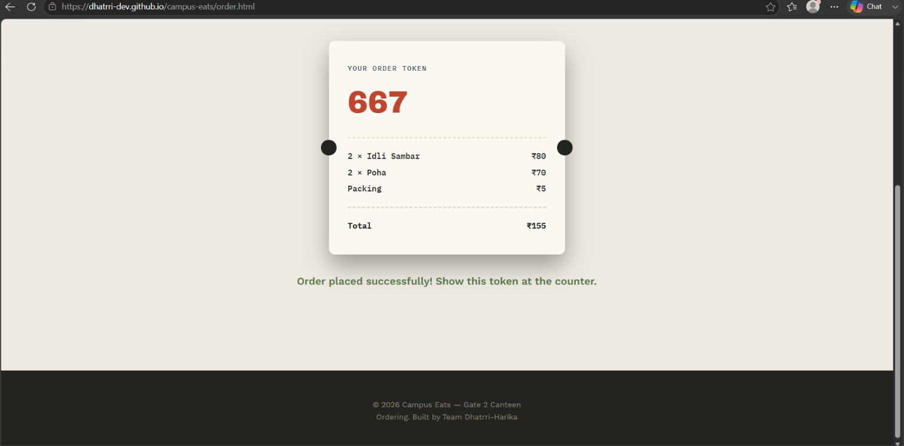

## 📁 Project Structure

```text
campus-eats/
│
├── assets/          # Project screenshots and other assets
│
├── index.html       # Home Page
├── menu.html        # Menu Page — search, filters, add-to-cart
├── cart.html        # Cart Page — dynamic cart rendering
├── order.html       # Order Page — order review + validated form
│
├── css/
│   └── style.css    # Shared design system and responsive layout rules
│
├── js/
│   └── script.js    # Shared JavaScript — cart logic, search/filters, form validation
│
├── images/          # Image assets folder
│   └── logo.png     # Logo image
│
└── README.md        # Project documentation
```